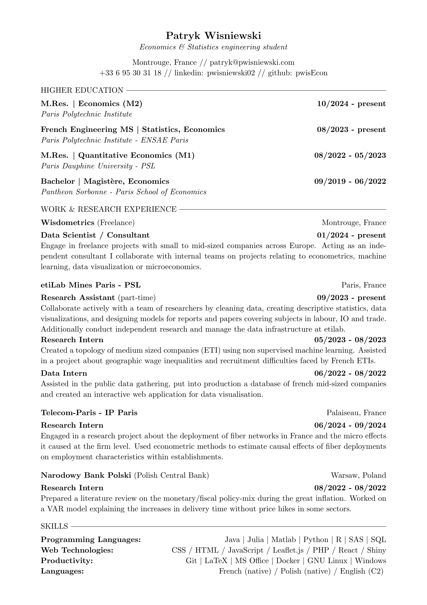

# Patryk Wisniewski's CV 

## Overview

This repository contains my Curriculum Vitae (CV) in multiple languages. This CV is written in LaTeX, a high-quality typesetting system; formatted with and without a picture. 

## Contents
The CVs are available in the root directory of this repository
-   `CV_'Language'.tex` - Those versions include a photograph in the specified language
-   `CV_'Language'_NoPic.tex` - Those versions omit the photograph for a more traditional layout.

To avoid redundancy most of the CV contents in each language are available in the `content/` directory. The photograph is also included in this directory.

## Contributions

While this is a personal repository, I appreciate any suggestions or corrections. Please feel free to submit a pull request or open an issue if you have any recommendations.

## Compiled CV without picture

